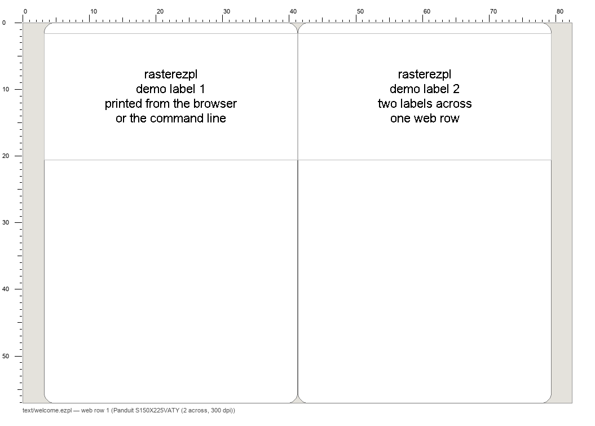
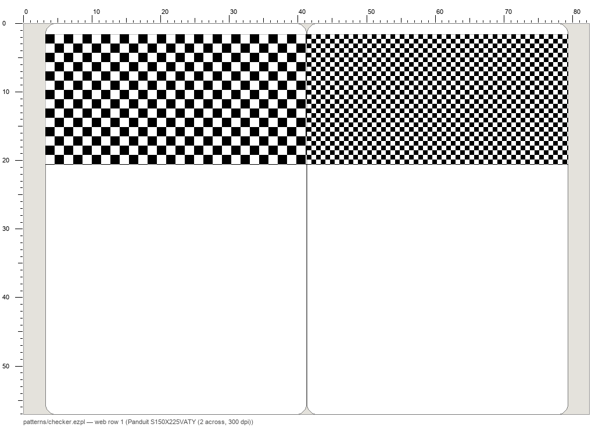

# rasterezpl

Print any bitmap to Godex-language (EZPL) thermal label printers from macOS or Linux, with no driver.

Works with Godex desktop printers (G500 and family) and with printers that are Godex OEMs and speak EZPL under
another badge, notably the **Panduit TDP43ME** (its own manual lists "Printer Language: EZPL"). If your label
software is Windows-only and your laptop is a Mac, this is the missing piece.

## What it does

- Draws each label on the host with a real font (the face and size your labels were proven with) at the
  printer's dpi, and sends it as a 1-bit bitmap in the exact stream Godex's own CUPS filter `rastertoezpl`
  emits. What you see in the preview is what prints, dot for dot.
- Talks to the printer directly: TCP port 9100, or the USB printer-class device itself (macOS 26 dropped raw
  CUPS queues, so USB goes through pyusb), or a raw CUPS queue on Linux, or a file for later.
- Keeps each printer's registration in a YAML registry on your machine, sent with every job as the printer's
  own margin commands, never baked into job files.
- Prints a **calibration ruler** in the printer's coordinate frame, optionally over a real label, so one print
  tells you the offset instead of a series of clipped test labels.
- Selects labels like a print dialog (`--labels 1,3,5-6`), decodes any job back to PNG, and refuses to send a
  job to a printer holding different stock.

## Install

```
pip install rasterezpl            # library + CLI
pip install "rasterezpl[usb]"     # + pyusb for --to usb: (needs libusb: brew install libusb)
```

## Five minutes with a Panduit TDP43ME on a Mac

```
rasterezpl usb                                   # find it: 195f:0001 Panduit TDP43ME serial 2546…
rasterezpl status --to usb:TDP43ME               # 00 = ready
rasterezpl text --media panduit-s150x225vaty-2up --font Arial --pt 5.4 \
    "dev-a Ethernet9/1\nRack 0101 U2\nPP.SITE:1.ROOM.R0101/A.U31.S1.A1" -o job.ezpl
rasterezpl ruler job.ezpl --to usb:TDP43ME --media panduit-s150x225vaty-2up   # one calibration label
```

Read the ruler: where the print-on area's edge on the x = 0 side cuts the scale is your x offset in dots; the
y reading at the print-on edge nearest the trailing edge, minus the media's placement, is y. Put them in the
registry, then print for real:

```yaml
# ~/.config/rasterezpl/printers.yaml
printers:
  tdp43me:
    transport: "usb:TDP43ME"          # or usb:<serial>, or tcp://192.168.1.50
    media: panduit-s150x225vaty-2up
    offset_in: [0.013, 0.03]          # dots / dpi
```

```
rasterezpl print job.ezpl --printer tdp43me --labels 1-2 --status
```

## Media

A `Media` is one stock on one printer: dpi, `^Q` length and gap, `^W` width, optional speed / darkness / stop
position, and the print areas on the label in inches in the *physical* frame (top = leading edge). Presets ship
for stocks verified on a printer; define your own in the registry's `media:` section. Every number should have
a source — the label vendor's format definition, a ruler print — because a wrong pitch looks exactly like a
printer offset until you print a ruler.

## Things learned the hard way

- The EZPL origin is the **trailing** edge of the label, x to the right as seen from the front. A label drawn
  leading-edge-up prints upside down at the tail. `Media.rotate180` (default on) handles it.
- `^XSET,OFFSET` is ignored by older firmware (the TDP43ME). `^R` (left margin) and `~Q` (row offset) work.
- Godex and Panduit printers can share one USB id (195f:0001). Select by serial or name.
- `Q` blocks take x in dots but carry bytes; the image is padded to the byte boundary so content stays at x.
- Bitmap data can contain `\rE\r`; jobs are parsed by declared lengths, never split on bytes.
- Use the printer's stored darkness and speed unless you know the values your old software sent.

## Try it with no printer

```
pip install rasterezpl
rasterezpl demo            # writes a demo root and opens the page on it
```

The demo's two "printers" are file spools: everything a real print does happens — the plan, the guards, the
proof, the send, the log — and the bytes land in `spool/<printer>.ezpl` instead of a head. Decode a spool or open
its proof and you see exactly what would have printed. The demo root holds text labels, test patterns (a
checkerboard, stripes, a dithered gradient) and the calibration ruler; its `README.txt` lists commands to try.
Swap a transport in its `printers.yaml` for `usb:<serial>` or `tcp://host` and the same page drives a real head.

| the proof of a demo text row | the checkerboard, dot for dot |
|---|---|
|  |  |

## Print from the browser

```
rasterezpl serve --root ~/labels --open     # → http://127.0.0.1:8123/rasterezpl/
```

The browser is the GUI; the `serve` process holds the printers. It lists every `.ezpl` under the root with
the media it was written for and the printers that hold that media, shows the proof of any label, and takes a
cart of files and label ranges to ONE print: the plan (file, labels, count, printer, refusal) is shown first,
a refused row stops the whole cart, and every send is appended to `<root>/.rasterezpl-printlog.jsonl`.

The same guards as `rasterezpl print`: a file goes only to a printer holding its media, and only if every block
lies inside that media's print areas. Paths are confined to the root. It binds `127.0.0.1` — a printer is a
physical output, so run it on the machine the printers hang off; `--host 0.0.0.0` is your call.

Your own page beside the job files can drive it, same origin — `GET /api/` lists the endpoints and
[docs/API.md](docs/API.md) documents them. The same plan-then-print from the command line:

```
rasterezpl printcart --root ~/labels a/b.ezpl:1-4,7 c/d.ezpl --dry-run   # the plan; drop --dry-run to send
```

### Your own labels

The page composes jobs too: type labels (one per block, `{n}` = running number), paste rows with a header and a
template like `{device} {port}\nRack {rack} U{u}`, or open an Easy-Mark `.pemx` project (its series data are the
texts). Pick the media and a face the server machine has, preview the exact print, compose → the job lands under
`<root>/composed/` with a `.json` sidecar (the spec, reloadable) and in the cart. No silent font substitution: a
face that is not on the machine is a refusal.

## Library

```python
import rasterezpl as rz
m = rz.PANDUIT_S150X225VATY_2UP
font = rz.find_font("Arial")
img = rz.render_text(m.area_px(0)[2:], ["line 1", "line 2"], font, rz.pt_to_px(5.4, m.dpi))
data = rz.job(m, [[img, None]])           # one web row, second label blank
rz.send(data, "usb:TDP43ME", m, offset_in=(0.013, 0.03))
```

## Status

Alpha. Verified on a Panduit TDP43ME (300 dpi, Panduit S150X225VATY two-across) and a Godex G500 (203 dpi,
92 × 34 mm flag stock) over USB from macOS 26. Reports from other EZPL printers and stocks are welcome.

MIT licence.
