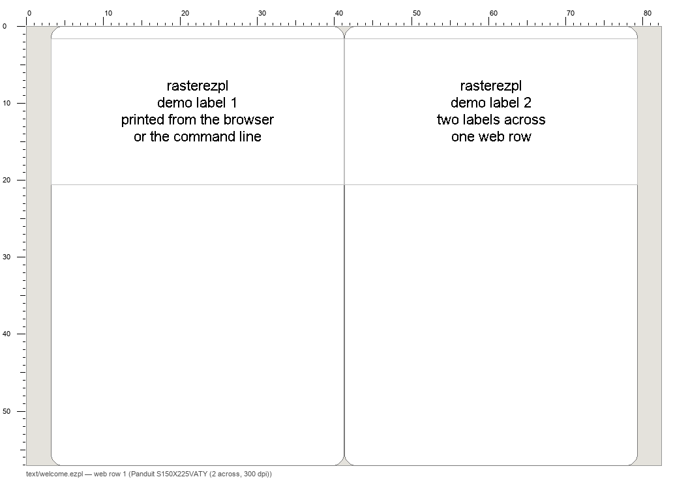
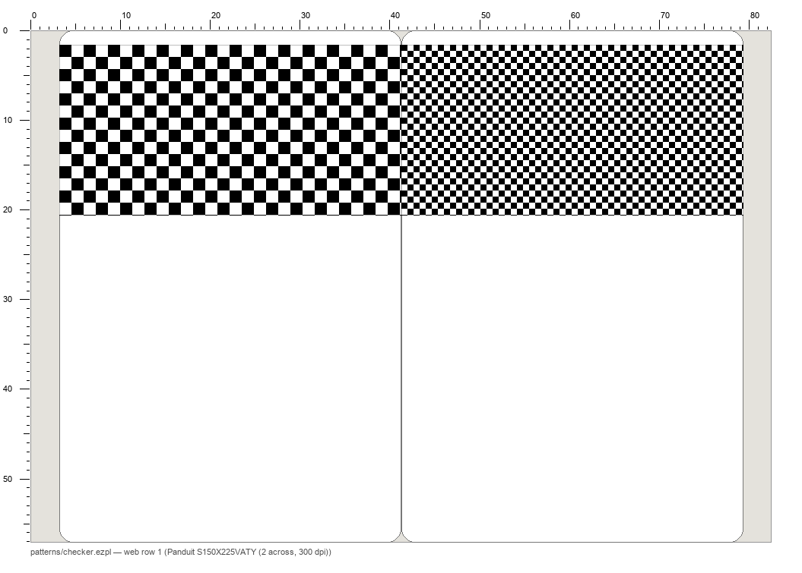
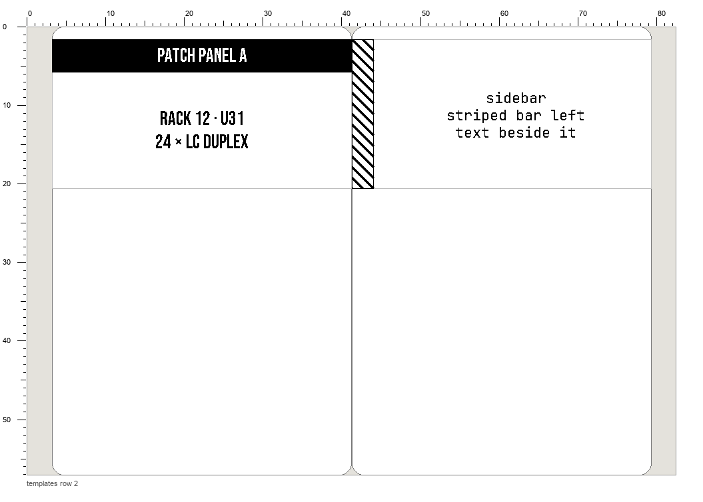
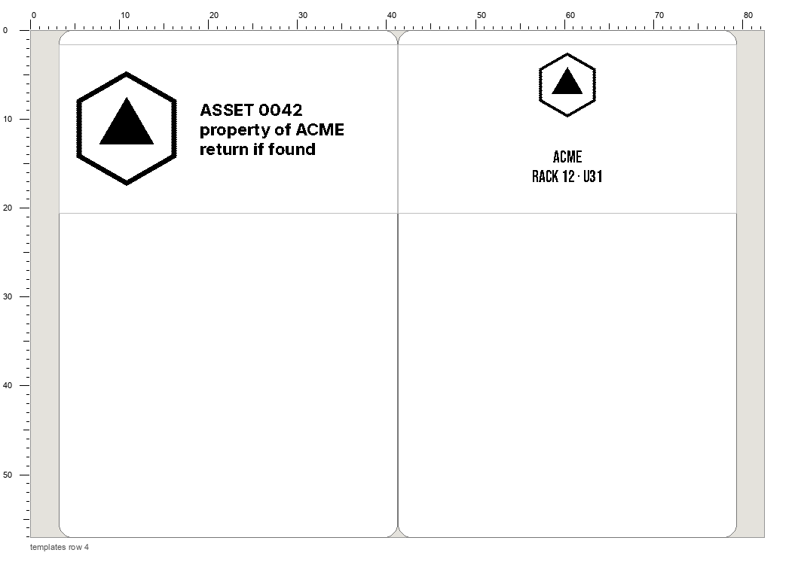
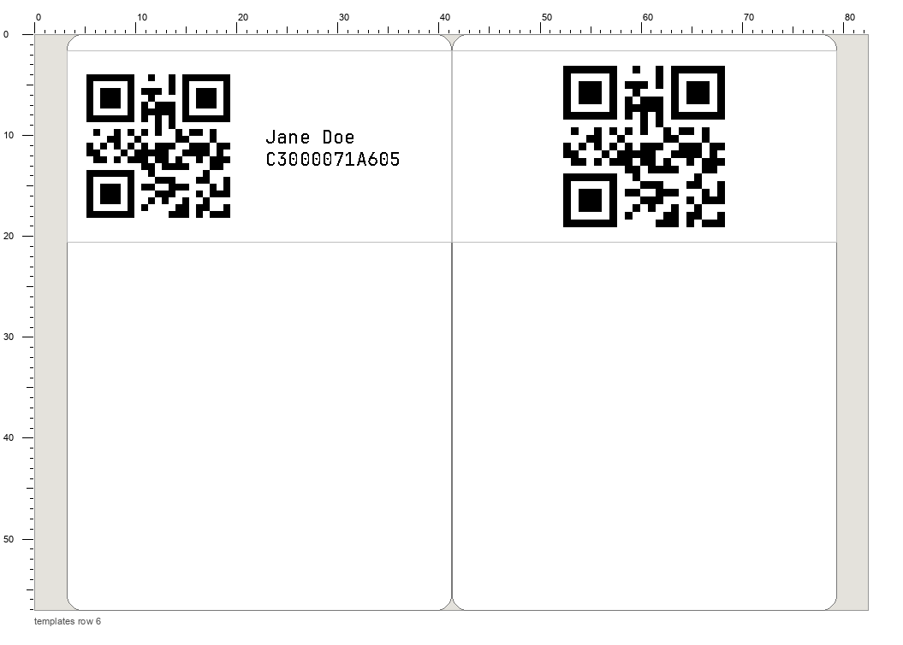
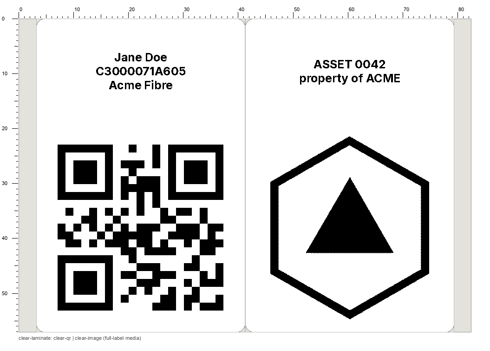

# rasterezpl

Print any bitmap to Godex-language (EZPL) thermal label printers from macOS or Linux, with no driver.

Works with Godex desktop printers (G500 and family) and with printers that are Godex OEMs and speak EZPL under
another badge, notably the **Panduit TDP43ME** (its own manual lists "Printer Language: EZPL"). If your label
software is Windows-only and your laptop is a Mac, this is the missing piece.

## What it does

- Draws each label on the host with a real font (the face and size your labels were proven with) at the
  printer's dpi, and sends it as a 1-bit bitmap in the exact stream Godex's own CUPS filter `rastertoezpl`
  emits. What you see in the preview is what prints, dot for dot.
- Talks to the printer directly: TCP port 9100, or the USB printer-class device itself (macOS 26 dropped raw
  CUPS queues, so USB goes through pyusb), or a raw CUPS queue on Linux, or a file for later.
- Keeps each printer's registration in a YAML registry on your machine, sent with every job as the printer's
  own margin commands, never baked into job files.
- Prints a **calibration ruler** in the printer's coordinate frame, optionally over a real label, so one print
  tells you the offset instead of a series of clipped test labels.
- Selects labels like a print dialog (`--labels 1,3,5-6`), decodes any job back to PNG, and refuses to send a
  job to a printer holding different stock.

## Install

```
pip install rasterezpl            # library + CLI
pip install "rasterezpl[usb]"     # + pyusb for --to usb: (needs libusb: brew install libusb)
```

## Five minutes with a Panduit TDP43ME on a Mac

```
rasterezpl usb                                   # find it: 195f:0001 Panduit TDP43ME serial 2546…
rasterezpl status --to usb:TDP43ME               # 00 = ready
rasterezpl text --media panduit-s150x225vaty-2up --font Arial --pt 5.4 \
    "dev-a Ethernet9/1\nRack 0101 U2\nPP.SITE:1.ROOM.R0101/A.U31.S1.A1" -o job.ezpl
rasterezpl ruler job.ezpl --to usb:TDP43ME --media panduit-s150x225vaty-2up   # one calibration label
```

Read the ruler: where the print-on area's edge on the x = 0 side cuts the scale is your x offset in dots; the
y reading at the print-on edge nearest the trailing edge, minus the media's placement, is y. Put them in the
registry, then print for real:

```yaml
# ~/.config/rasterezpl/printers.yaml
printers:
  tdp43me:
    transport: "usb:TDP43ME"          # or usb:<serial>, or tcp://192.168.1.50
    media: panduit-s150x225vaty-2up
    offset_in: [0.013, 0.03]          # dots / dpi
```

```
rasterezpl print job.ezpl --printer tdp43me --labels 1-2 --status
rasterezpl print job.ezpl --printer tdp43me --dry-run         # the guards + the summary, nothing sent
rasterezpl print job.ezpl --printer tdp43me --dry-run --proof job.pdf   # + every web row as a true-scale PDF page
rasterezpl print job.ezpl --printer tdp43me --labels 97-128 --bookends  # + a START label before, an END label after
```

`--bookends` puts the job's own start and end marks on the paper: a START block before the labels and an END
block after them, in the same send. A crew tearing strips off a roll of hundreds cannot tell from the paper where
one job ends or whether it completed — the last label looks like every other, and the only record was the print
log on the Mac. The marks are black with hazard-striped edges, a look no cable label carries; START says which
file, which labels of how many (`labels 97-128 of 128` on a resume), the count, the printer and the time; END
carries a CUT HERE band and `32/32 sent` — a missing END label means the job was cut. They ride in the job's own
stream, after the selection and before the heat: never selectable, never counted as labels, retuned like them,
and an END label in the hand is proof the whole stream arrived. Two blocks per job (a two-across web spends two
labels per mark); off unless asked for. `--proof` shows them as the first and last page.

On a media whose die-cut label is larger than its print area and known to the registry (`labels_in` — the
Panduit self-laminating stock: a 0.75 in white block and a 1.5 in clear tail), the mark covers the WHOLE label
(0.18.0): the word on the black block, the details in black on the clear tail in the largest face that fits.
The tail takes thermal-transfer ink like the block does, and on a work tag it is wasted otherwise — the
white-on-black details on the block alone were barely legible on the roll. A media without a label outline
keeps the block-only mark.

A partial selection on a two-across (or wider) web is **packed** into full rows (0.17.0): the selected labels,
in label order, laid into rows area by area, so no row carries a blank except possibly the last. Seven
one-side labels (`--labels 2,4,6,8,10,14,16` — the T2-end copies of seven cables, every one the right area of
its row) go on 4 rows, not 7 rows with a blank label each; label stock is dear, ink is cheap. A selection that
is whole rows anyway (`1-128`, the whole file, `3-4`) is sent byte for byte as before; packing happens only when
at least one row is partly selected, the summary then says `7 labels → 4 rows (packed)` and the print log
carries `rows` and `packed` (the `labels` key keeps the selection as given — the paper is traced by label
numbers). A label is moved only between print areas of the same size in dots; a media whose areas differ is
never packed, the labels keep their own rows with the other area blank, and the summary says why.
`--no-pack` keeps every label in its original row and area on any media. `--proof` shows the packed rows.

## Long jobs on an Ethernet board

Learned on a Panduit TDP43ME with the NetPS Ethernet board (`tcp://…:9100`), 2026-10-16, eight 128-label jobs
of ~1.2 MB each:

- **Accepted is not printed.** The board takes a 1.2 MB job in 35 s to 2 min and prints it from its buffer over
  the following minutes. "sent 1,273,901 bytes" means the board has it, not that the roll does. The END label of
  `--bookends` on the roll is the physical idle gate: a job is done when its END is in your hand.
- **One connection at a time.** A NEW connection opened while the board still prints the previous job is reset —
  the send dies with a broken pipe after some bytes, the roll shows that job's START and nothing behind it — and
  the reset can wedge port 9100 until the board restarts its print server on its own (~90 s of refused
  connections while ping and the web UI answer; its `/status.htm` says *Restart Server is ongoing*). INSIDE one
  connection there is no such moment: the board takes bytes as its buffer drains, TCP blocks the sender, and the
  chunked send rides the stall — a 1.27 MB job took ~2 min this way and never failed.
- **So a cart is ONE stream per printer (0.16.0).** `printcart` composes, for each printer, one job: the
  registration prefix once, the darkness / speed retuned once in front, then every file in cart order — its START
  mark, its selected blocks, its END mark when `--bookends` is on — and sends it over one connection. No gap
  between files, nothing to wait for, no second connection to be reset. Each file is logged with its place in
  the stream (`stream: {id, offset, length}`), so the paper, the files and the bytes line up: with bookends,
  the START and END of each file are on the roll in order.
- **Before the stream's connection** the port is waited on: refused, timed out, or closed at once by the board =
  not ready, retried with backoff for up to 900 s, never a failed job. A connection the printer closes BEFORE any
  byte was accepted is retried — nothing is on the paper. One closed after bytes were accepted is never retried:
  those labels are on the paper, and a resend would print them twice.
- **A cut stream is reported file by file.** The files wholly before the cut are logged ok; the file in flight is
  logged `ok: false` with the web row the cut fell in (`cut inside labels-mtp-B31 at web row 12 of 66`) and the
  command prints the resume range (`--labels 23-132`) — the operator's call from what the roll shows; the files
  after it are logged as not sent. Nothing is ever resent on its own.
- **Every send is logged**, success or failure — `print`, `printcart` and `POST /api/print` alike — with `ok`,
  `bytes_sent` and `error`; `print` logs beside the job file (`--log` elsewhere). Before 0.14.0 only `printcart`
  logged, and a day's single prints had no record but the terminal.
- A printer record's `settle` block (0.15.0) is read for an old YAML's sake and ignored with a note: there is no
  gap between files to wait for any more.

## Faded print

Thermal transfer on polyester drops thin strokes when the head runs cool or fast. Two levers, independent:

- **Heat, per printer, at send time.** Give the printer record a `darkness: 17` (^H, 0–19) and/or `speed: 2`
  (^S, ips) in `printers.yaml`; every job sent through that record is retuned on the way out and the job files
  stay as generated. `rasterezpl print --darkness 17 --speed 2` does it for one print.
- **Thicker glyphs in the raster.** `stroke: 1` (or 2) on the composer, the *weight* select on the page, or
  `rasterezpl text --stroke 1`, adds that many dots of ink around every glyph outline — any face, any size.

## Media

A `Media` is one stock on one printer: dpi, `^Q` length and gap, `^W` width, optional speed / darkness / stop
position, and the print areas on the label in inches in the *physical* frame (top = leading edge). Presets ship
for stocks verified on a printer; define your own in the registry's `media:` section. Every number should have
a source — the label vendor's format definition, a ruler print — because a wrong pitch looks exactly like a
printer offset until you print a ruler.

## Things learned the hard way

- The EZPL origin is the **trailing** edge of the label, x to the right as seen from the front. A label drawn
  leading-edge-up prints upside down at the tail. `Media.rotate180` (default on) handles it.
- `^XSET,OFFSET` is ignored by older firmware (the TDP43ME). `^R` (left margin) and `~Q` (row offset) work.
- The printer KEEPS `^R` / `~Q` (and `^H` / `^S`) between jobs — its self-test slip prints the stored values. A
  job that states none prints with whatever the last job left: a second stock on the same head with "no
  offset" inherited the first stock's +24 / +9 dots, and a ruler read 24 dots off (2026-10-25). Every send
  now states its registration, a zero included, the ruler too; give a head that carries two stocks its heat
  in each record rather than relying on "the printer's own setting".
- A stock whose die is turned round on the web (the white block at the trailing end) shares the page with
  the one it resembles but not the frame: `rotate180: false` with the same areas puts the block at the other
  end, and `same_stock` keeps the two apart so a job for one is never sent to the other.
- Godex and Panduit printers can share one USB id (195f:0001). Select by serial or name.
- `Q` blocks take x in dots but carry bytes; the image is padded to the byte boundary so content stays at x.
- Bitmap data can contain `\rE\r`; jobs are parsed by declared lengths, never split on bytes.
- Use the printer's stored darkness and speed unless you know the values your old software sent — and once
  two stocks share a head, record each one's (the stored value is the last job's).

## Try it with no printer

```
pip install rasterezpl
rasterezpl demo            # writes a demo root and opens the page on it
```

The demo's two "printers" are file spools: everything a real print does happens — the plan, the guards, the
proof, the send, the log — and the bytes land in `spool/<printer>.ezpl` instead of a head. Decode a spool or open
its proof and you see exactly what would have printed. The demo root holds text labels, test patterns (a
checkerboard, stripes, a dithered gradient) and the calibration ruler; its `README.txt` lists commands to try.
The demo never reaches a real printer, by design; its "check" reports the spool. To print the demo jobs for real,
serve the same root with your own registry — `rasterezpl serve --root <demo dir> --open` uses
`~/.config/rasterezpl/printers.yaml` — and the plan routes each job to the head holding its media.

| the proof of a demo text row | the checkerboard, dot for dot |
|---|---|
|  |  |









## Print from the browser

```
rasterezpl serve --root ~/labels --open     # → http://127.0.0.1:8123/rasterezpl/
```

The browser is the GUI; the `serve` process holds the printers. It lists every `.ezpl` under the root with
the media it was written for and the printers that hold that media, shows the proof of any label, and takes a
cart of files and label ranges to ONE print: the plan (file, labels, count, printer, refusal) is shown first,
a refused row stops the whole cart, and every send is appended to `<root>/.rasterezpl-printlog.jsonl`. A
*bookends* checkbox (off by default) puts a START and an END label around every file's labels, in that file's
send, so the roll itself shows where each job begins and that it completed.

The same guards as `rasterezpl print`: a file goes only to a printer holding its media, and only if every block
lies inside that media's print areas. Paths are confined to the root. It binds `127.0.0.1` — a printer is a
physical output, so run it on the machine the printers hang off; `--host 0.0.0.0` is your call.

Your own page beside the job files can drive it, same origin — `GET /api/` lists the endpoints and
[docs/API.md](docs/API.md) documents them. The same plan-then-print from the command line:

```
rasterezpl printcart a/b.ezpl:1-4,7 c/d.ezpl --root ~/labels --dry-run   # the plan; drop --dry-run to send
rasterezpl printcart composed/labels-3835b428.ezpl --dry-run             # from the served root itself
rasterezpl printcart a.ezpl b.ezpl c.ezpl --bookends                      # ONE stream: START a END START b END START c END
```

A cart is ONE stream per printer: the files go back to back over one connection, in cart order (see *Long jobs
on an Ethernet board*). `--bookends` marks every file inside the stream: START, that file's labels, END (see
`print --bookends`); the plan shows `+2 bookends` on each row and keeps `count` as the labels. The page has
the same as a checkbox beside *print*, off by default, and the API takes `"bookends": true`; the print log
marks each entry. `--proof F.pdf|F.png` writes the composed stream as a proof (one document per printer). A cut
stream is logged file by file, the exit code is 1, and nothing is resent.

Each file's partial selection is packed into full rows (see `print`, 0.17.0) — per FILE, never across files: a
web row never mixes two files and the bookends stay per file. The plan row says `2,4,6,8,10,14,16 → 4 rows
(packed)` and the stream description `7 labels → 4 rows, packed`; a whole-row selection is unchanged and says
nothing. `--no-pack` (the page's *pack partial rows* checkbox unticked, `"pack": false` on the API) keeps every
label in its original row and area.

### Your own labels

Four faces ship with the package under the SIL Open Font License — Inter, Inter Bold, JetBrains Mono, Bebas
Neue — so a label composed on one machine renders identically on another. Six layouts decorate the text:
`framed`, `banner` (first line white on black), `sidebar`, `corners`, `ticket`, and `plain`; each has a sample
the page fills in with one click, and the demo root shows them all in `templates/layouts.ezpl`.

Pictures print too: a PNG or JPEG, or an SVG when the machine has `cairosvg` or `rsvg-convert`, fitted and
turned into the head's one-bit image (dithered, or thresholded for a two-tone mark). Three layouts take one:
`logo` (picture left, text beside — asset tags), `logo-top`, and `image` alone. The demo draws a placeholder
mark; put your own logo on a label from the page and it never leaves your machine.

A self-laminating label can be printed whole: the clear laminate takes the ribbon's ink like the white block.
The `panduit-s150x225vaty-2up-full` media allows the entire die-cut label, and the `clear-qr` / `clear-image`
layouts put the text on the white third and a large code or picture on the clear two thirds — for a tag stuck
flat, not one that wraps. The same printer takes it: a printer holds a stock, and variants of that stock at the
same dpi differ only in where blocks may go.

QR codes are built in (segno, pure Python): the `badge` layout puts a code across the top and the lines below —
a check-in badge from a CSV of names and ids is one compose, `qr` set to `{id}` — with `qr-left` for narrow
stock and `qr` for the code alone.

Code 128 barcodes are built in too (encoded here, no dependency): the `barcode` layout draws the bars across the
top and the lines below, `barcode-below` the lines on top and the bars under them — the rack or asset label
whose barcode scans to exactly its text — and `barcode-only` the bars alone. They encode the same `qr` data (a template such as `{rack}`), at the widest
whole-dot module that fits the label, and refuse a code that would print finer than two dots per module.


The page composes jobs too: type labels (one per block, `{n}` = running number), give a **list of labels** — open
a `.csv` / `.tsv` or paste a sheet, one label per row, with a template like `{device} {port}\nRack {rack} U{u}`
saying which columns go where (the columns appear as buttons; no template = every column on its own line; a
file without a header line is `col1`, `col2`, …; the delimiter is sniffed, a BOM and blank rows are tolerated,
and the count and the first label are shown before anything is composed) — or open an Easy-Mark `.pemx`
project (its series data are the texts). Pick the media and a face the server machine has, preview the exact
print — it follows every change you make, and a *row* field picks which web row it shows —
compose → the job lands under `<root>/composed/` with a `.json` sidecar (the spec, with the list and the
template) and in the cart. No silent font substitution: a face that is not on the machine is a refusal.

A composed job is a **recipe**: *recent compositions* lists them (media, face, size, layout, weight, template,
input) and *reload* puts one back in the form — the favour someone asks for every week is: reload, swap the
list, preview, print. The same from the command line: `rasterezpl text --rows list.csv --template "{name}\nR{rack}"
--layout barcode-below --qr "{rack}" …`. Nothing here is a drawing tool: the input is a list and a named layout,
the output is the exact raster, and the same recipe on the same list prints the same labels next month.

## Library

```python
import rasterezpl as rz
m = rz.PANDUIT_S150X225VATY_2UP
font = rz.find_font("Arial")
img = rz.render_text(m.area_px(0)[2:], ["line 1", "line 2"], font, rz.pt_to_px(5.4, m.dpi))
data = rz.job(m, [[img, None]])           # one web row, second label blank
rz.send(data, "usb:TDP43ME", m, offset_in=(0.013, 0.03))
```

## Developing

`make check` runs what CI runs — ruff, `ruff format --check`, mypy and the tests — in that order; run it before
a push (CI was red for a week of releases on mypy errors nobody ran locally).

## Status

Alpha. Verified on a Panduit TDP43ME (300 dpi, Panduit S150X225VATY two-across) and a Godex G500 (203 dpi,
92 × 34 mm flag stock) over USB from macOS 26. Reports from other EZPL printers and stocks are welcome.

MIT licence.
